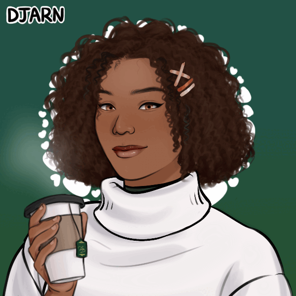

<h2 align="center">
Olá Mundo!👋🏾   
</h2> 

  

   
  Me chamo Paloma, tenho 23 anos e sou de Salvador/Bahia.  
  Sou Bacharel em Ciências e Tecnologia e atual discente no curso de Sistemas de Informação.  
   
  Além da graduação em progresso, busco  sempre me aprofundar e colher toda oportunidade que possa contribuir para construir meu caminho rumo a carreira de desenvolvedora.
  Assim, estudo de forma individual realizando cursos e participando de bootcamps, que confio que podem alavancar o meu potencial e concretizar meu sonho que também é meu objetivo: ingressar na área de tecnologia. 

##

  Essas são as tecnologias que estou me aperfeiçoando atualmente:

 
  
  
  
  
  

##

 
  <h5>E esses são meus contatos.  
  Conecte-se comigo!
</h5>
  
   

